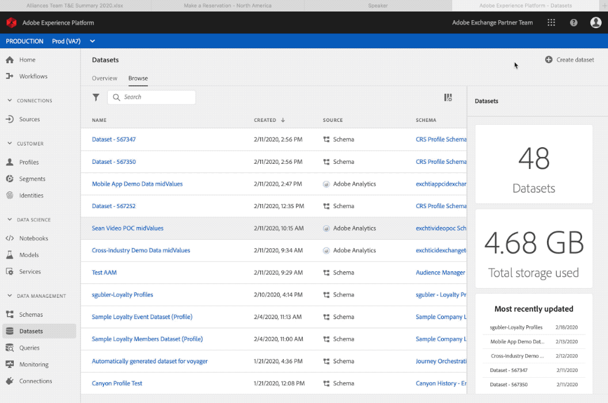

# Erstellen von Schemata und Datensätzen

Die [Postman-](https://github.com/Adobe-Marketing-Cloud/exchange-aep-profile-integration-postman) wird im gesamten Artikel mithilfe der zugehörigen Aufrufe nach Nummer referenziert. Weitere Informationen zur Installation und Verwendung der Postman-Sammlung finden Sie auf der GitHub-Seite [README](https://github.com/Adobe-Marketing-Cloud/exchange-aep-profile-integration-postman/blob/master/README.md). Es gibt auch Beispieldatensätze mit [Treueprogramm](https://github.com/Adobe-Marketing-Cloud/exchange-aep-profile-integration-postman/blob/master/AEP%20loyalty%20events.json)- und [Profil](https://github.com/Adobe-Marketing-Cloud/exchange-aep-profile-integration-postman/blob/master/AEP%20loyalty%20profiles.json)Daten.

## Schemata

Ein Schema ist ein Regelsatz, der die Datenstruktur und das Datenformat repräsentiert und überprüft. Schemata bieten eine übergeordnete abstrakte Definition eines realen Objekts (z. B. einer Person) und bestimmen, welche Daten in jeder Instanz dieses Objekts enthalten sein sollen (z. B. Vorname, Nachname, Geburtsdatum). Schemata können in der Benutzeroberfläche oder mithilfe der [!DNL Experience Platform]-APIs erstellt werden.

Weitere Informationen finden [&#x200B; in &#x200B;](https://www.adobe.io/apis/experienceplatform/home/xdm/xdmservices.html#!api-specification/markdown/narrative/technical_overview/schema_registry/schema_composition/schema_composition.md) Dokumentation .

### Erstellen eines Schemas

Partner können ein Schema mithilfe der Benutzeroberfläche erstellen, indem sie diesem [&#x200B; folgen](https://docs.adobe.com/content/help/de-DE/experience-platform/xdm/tutorials/create-schema-ui.html). In diesem Beispiel wird das Profilschema des Treueprogramms verwendet. Während das Beispiel ein Profilschema ist, können ereignisbasierte Schemata mit einem ähnlichen Prozess verwendet werden.

Um die APIs verwenden zu können, müssen Partner über eine vorhandene Adobe I/O-Integration mit aktivierten [!DNL Experience Platform] verfügen. Weitere Informationen finden Sie in diesem Handbuch [Erstellen einer I/O-Integration](https://docs.adobe.com/content/help/de-DE/experience-platform/tutorials/home.html#!api-specification/markdown/narrative/tutorials/authenticate_to_acp_tutorial/authenticate_to_acp_tutorial.md).

Unter [diesem Link](https://docs.adobe.com/content/help/de-DE/experience-platform/xdm/tutorials/create-schema-api.html) erfahren Sie, wie Sie Schemas mithilfe der API erstellen.

Um ein Schema über Postman zu erstellen, verwenden Sie die Aufrufe in den Ordnern 1: Schema erstellen, 1a: Schema für PROFILDATEN erstellen ODER 1b: Schema für EREIGNISDATEN erstellen.

## Datensätze

Alle Daten, die in Adobe [!DNL Experience Platform] importiert werden, sind in Datensätzen enthalten. Ein Datensatz ist ein Konstrukt zur Datenspeicherung und -verwaltung, in dem Daten (in der Regel) in einer Tabelle erfasst werden, die ein Schema (Spalten) und Felder (Zeilen) beinhaltet. Datensätze enthalten auch Metadaten, die verschiedene Aspekte der in ihnen gespeicherten Daten beschreiben.

Catalog Service ist ein Aufzeichnungssystem für den Speicherort und die Herkunft von Daten in [!DNL Experience Platform] und wird zum Erstellen und Verwalten von Datensätzen verwendet. Der Katalog verfolgt die Metadaten für jeden Datensatz. Darin enthalten ist ein Verweis auf das Schema des Experience-Datenmodells (XDM), dem der Datensatz entspricht (im nächsten Abschnitt erläutert), und die Anzahl der in diesen Datensatz aufgenommenen Datensätze.

Eine [&#x200B; Datensatzübersicht &#x200B;](https://docs.adobe.com/content/help/de-DE/experience-platform/catalog/datasets/overview.html) Sie hier.

### Erstellen eines Datensatzes

<!-- 
We don't yet support hover text in images (and we render it poorly when included). I removed "Creating a Dataset" from the above image link. We can add it back when we support it (Summer 2020?) -Bob
-->

Erstellen eines Datensatzes über die Benutzeroberfläche:

1. Klicken Sie **[!UICONTROL Datensatz erstellen]**.

1. Klicken Sie **[!UICONTROL Aus Schema erstellen]**.

1. Klicken Sie auf **[!UICONTROL Fertigstellen]**.

[&#x200B; Sie &#x200B;](https://docs.adobe.com/content/help/de-DE/experience-platform/catalog/datasets/user-guide.html) Datensatz-Benutzerhandbuch.

[Erstellen eines Datensatzes mithilfe der APIs](https://docs.adobe.com/content/help/de-DE/experience-platform/catalog/datasets/create.html).

Um einen Datensatz über Postman zu erstellen, verwenden Sie die Ordner 2: Datensatz erstellen, 2a: Datensatz für PROFILDATEN ERSTELLEN ODER 2b: Datensatz für EREIGNISDATEN ERSTELLEN.

## Best Practices für Schemas und Datensätze für Partner

* Partnerdaten sollten ein separates Profilschema verwenden, anstatt ein Mix-in für das vorhandene Profilschema und Erlebnisschema eines Kunden zu erstellen.
* Partner sollten nach Möglichkeit Adobe-Klassen und Mix-Ins verwenden.
* Partner sollten ihre Daten mit einem separaten Datensatz hochladen, anstatt zu versuchen, ihre Daten in einem vorhandenen Datensatz zu kombinieren.
* Partner können ihre Schemata derzeit nicht in die globale Registrierung hochladen.
